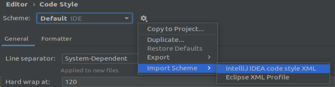
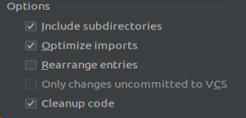
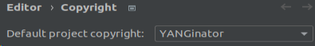

## File generating
To correctly generate files follow steps in
[rfc-parser/README.md](rfc-parser/docs/README.md) file

To successfully enable Highlighter follow steps in
[intelij-plugin/docs/README.md](intelij-plugin/docs/README.md) file

Generated files have different code style ane are without copyright header

---
### Code Style setup

First we need to import correct code style to IDE

* In IntelliJ IDEA go to ***Settings/Editor/Code style***  
* Next to Scheme selection click on **Show Scheme Actions** 
choose **Import Scheme** and then **IntelliJ IDEA code style XML**  
* Select file **CodeStyle.xml** located in ***config*** folder

* Then you can choose own name for style,
after import make sure this style is chosen in **Scheme** 
selection setting and save the changes.

* then apply imported style to generated files,
  * In project window select folders with generated files, or whole ***tech.pantheon.yanginator.plugin*** package
  * then from context menu select **Reformat Code** (*Ctrl+Alt+L*) 
  * then in options window select **Optimize imports** and **Cleanup code** and click **run**

  

---
### Copyright

* In IntelliJ IDEA go to ***Settings/Editor/Copyright/Copyright Profiles***  
* At top of the page on left side click on import button 
, 
select **YANGinator-Copyright.xml** file located in ***config*** folder

* Make sure that correct copyright profile is selected in ***File/Settings/Editor/Copyright*** setting tab

* To apply copyright to generated files, select files or folders and from context menu choose **update Copyright**
  * **\_YangLexer.java**
  * **psi** folder
  * **YangParser.java** or **parser** folder

If you create new files, also apply copyright on them

***
***
When solving a grammar issue, you can just edit ***YangGrammar.bnf*** file 
and generate files from it without using parser to try if your solution works.  
**But for final solution** you have to edit **uncompliantUtils** in **rfc-parser** or tokens in **Tokens.xml**,
so **rfc-parser** would generate ***YangGrammar.bnf*** with changes you need.

For grammar these **rfc** models are used:  
* [**YANG 1.0**](https://www.rfc-editor.org/rfc/rfc6020)
* [**YANG 1.1**](https://www.rfc-editor.org/rfc/rfc7950)

All changes in comparison to rfc model should by noted to file
[ModelDeviations](rfc-parser/docs/ModelDeviations.md) where you can also find solutions to problems

***
***

