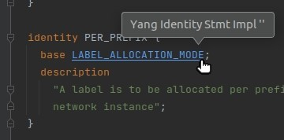
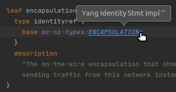
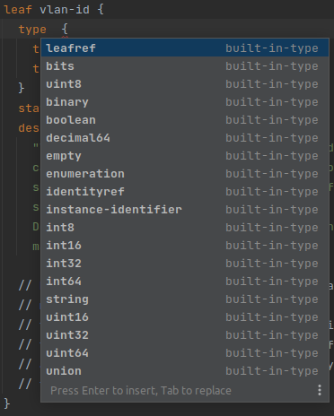
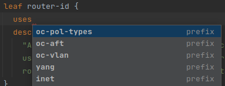
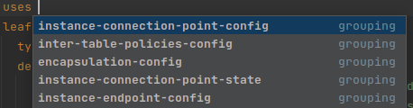
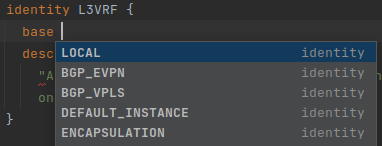
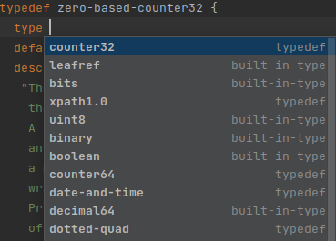
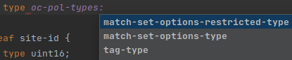
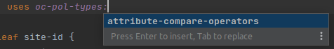
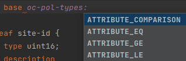

# Go to declaration

- ####Enables go to declaration from
    - **base** to _identity_
    - **uses** to _grouping_
    - **type** to _typedef_

- ####Example
    - Declaration in current file:

      

    - Declaration in another file (in the same project):

      

# Code Completion

- ####Built-in types

    - After **type** keyword is offered pop-up with built-in types

      

- ####Prefix statements
    - Pop-up with prefixes is offered after **uses, base, type** keywords

      

- ####Declarations of typedef, grouping, identity statements in current file
    - after **uses** keyword

      
    - after **base** keyword

      
    - after **base** keyword
    -
    

- ####Declarations of typedef, grouping, identity statements in another file

    - after **type** with corresponding prefix

      
    - after **uses** with corresponding prefix

      
    - after **base** with corresponding prefix

      