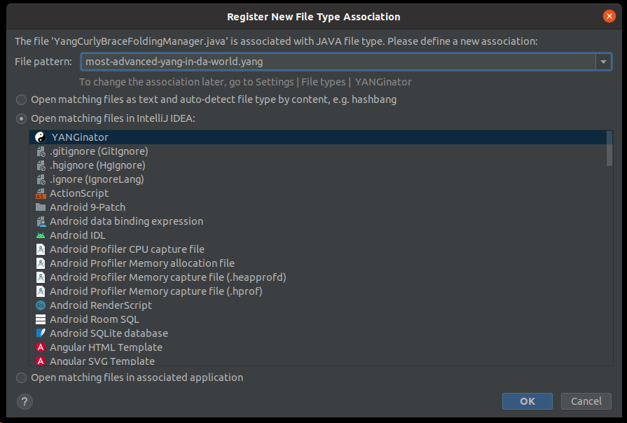

YANGinator | An IntelliJ YANG Validation Plugin
=============

This [IntelliJ](https://www.jetbrains.com/idea/) plugin adds support for validating YANG files. Developers and enthusiasts will have the option to validate their YANG files before deployment.

# Features

- Base validation for [YANG 1.0](https://datatracker.ietf.org/doc/html/rfc6020)
- Syntax highlighting 
- Auto completion
- Code folding (curly brackets, multi-line strings, multi-line comments)
- Commenting
- Paired brace matcher
- Breadcrumbs support
- Go to declaration

# Development Environment

Follow this tutorial [IntelliJ Custom Language Support Tutorial](https://plugins.jetbrains.com/docs/IntelliJ/custom-language-support-tutorial.html) to add custom lanugage support in IntelliJ.

# Installing YANGinator

### 1. Install YANGinator

The easiest way to find the *Plugins* window in IntelliJ, is by using the *Search everywhere* window (by default, double-tap the Shift key). Search for *plugins*.

You can also find YANGinator in the [official IntelliJ Marketplace here.](https://plugins.jetbrains.com/plugin/17935-yanginator)

### 2. Search for YANGinator

In the newly opened *Plugins* window, search for *YANGinator*.

### 3. Restart IDE

The YANGinator plugin will be enabled after restart.

### 4. Register *New File Type* Association

- Open any YANG file.

- Open the *Register New File Type Association* window.

- The easiest way to do so is, by using the *Search Everywhere* window.

Search for *Associate with file type..*

- Select *Open matching files* in IntelliJ IDEA:
- Select *Yang*

4.4 Press OK button.

### 5. Enjoy YANGinator

YANGinator will be enabled by now. Enjoy!

### 6. Help Us Continue

If you found a bug, problem, or have an idea for a possible feature, create an [Issue here](https://github.com/PANTHEONtech/YANGinator/issues).

*Please browse the open issues before opening a new one.*

6.1 If YANGinator helped you, consider giving the repository a star!

### 7. Happy coding!
