# Generating BNF grammar with some deviations

path = intelij-plugin/src/main/gen/tech/pantheon/yanginator/plugin

## Deviations from the original grammar

Following methods are used to modify the transformed BNF grammar for the plugin to function
correctly.

* `quoteStmts(lines)` [link](#Allows-statements-to-be-quoted)

* `splitDeviationStmt(result);` [link](#Split-deviation-statement)

* `removeOptional(result);` [link](#Removing-optional)

* `subDelimsAdjustment(result);` [link](#Sub-delims-adjustment)

* `rewriteYangInitialization(result);` [link](#Rewrite-Yang-Initialization)

* `additionalRules(result);` [link](#Additional-rules)

* `quotedAugmentArg(result);` [link](#Quoted-augment-arg)

* `quotedPath(result);` [link](#Quoted-path)

* `quotedStringSplitter(result);` [link](#Quoted-string-splitter)

* `linkageBodyReplace(result);` [link](#Changing-linkage-body)

* `metaBodyReplace(result);` [link](#Changing-meta-statement-body)

* `rewriteScheme(result);` [link](#Rewrite-scheme)

* `rewritePort(result);` [link](#Rewrite-port)

* `rewriteDateArg(result);` [link](#Improved-date-validation)

* `rewriteIdentifier(result);` [link](#Rewrite-identifier)

* `rewriteUnreserved(result);` [link](#Rewrite-unreserved)

* `rewriteZeroIntegerValue(result);`[link](#Rewrite-Zero-Integer-Value)

* `rewriteIPV4Address(result);`[link](#Rewrite-IPV4-Address)

* `makeSeparatorRulesPrivate(result);` [link](#make-separator-rules-private)

* `orderTokensForLexer(result);`[link](#Order-Tokens-For-Lexer)

* `rewriteFractionDigitsArg(result);`[link](#Rewrite-Fraction-DigitsArg)

* `rewritePositiveIntegerValue(result);`[link](#Rewrite-Positive-Integer-Value)

* `adjustModuleAndSubmoduleStmt(result);`[link](#Adjust-Module-And-Submodule-Stmt)

* `rewriteModuleHeaderStmts(result);`[link](#Rewrite-Module-Header-Stmts)

* `rewriteSubModuleHeaderStmts(result);`[link](#Rewrite-SubModule-Header-Stmts)

* `rewriteDataDefStmt(result);`[link](#Rewrite-Data-Def-Stmt)

* `rewriteBodyStmts(result);`[link](#Rewrite-Body-Stmts)

* `adjustUnknownStatement(result);`[link](#Adjust-Unknown-Statement)

* `allowVersionOne(result);`[link](#Allow-Version-One)

* `patternBodyChange(result);`[link](#Pattern-Body-Change)

* `adjustRelPathKeyexpr(result);`[link](#Adjust-Rel-Path-Keyexpr)

* `swapDecimalWithIntegerInRangeBoundaryDef(result);`[link](#Swap-Decimal-With-Integer-In-Range-Boundary-Def)

* `allowComments(result);`[link](#Allow-Comments)

* `addStringSplittersForIfFeatures(result);` [link](#add-splitters-for-if-features) 

* `allowIndentString(result);`[link](#Allow-indents-for-certain-strings)

* `rewriteUsesAugmentStmt(result);`[link](#Rewrite-Uses-Augment-Stmt)

* `adjustDoubleColonInPchar(result);`[link](#Adjust-Double-Colon-In-Pchar)

* `allowReferenceLinkage(result);`[link](#Make-linkages-referencable)

* `changeInputOutputCardinality(result);`[link](#Change-input-and-output-data-def-stmt-cardinality)

### Rewrite Zero Integer Value

  Rewrites zero-integer-value with proper tokens

  Before:

  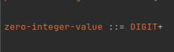

  After:

  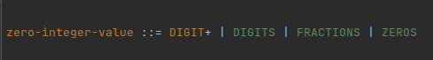

### Rewrite IPV4 Address

  Rewrites IPv4address with proper token

  Before:

  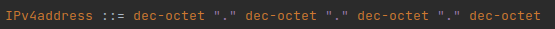

  After:

  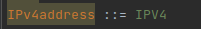

### Adjust Double Colon In Pchar

  Adjust Double Colon In Pchar

  Before:

  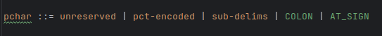

  After:

  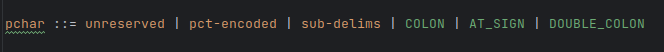

### Order Tokens For Lexer 

  Order of tokens sets the priority for lexer when it needs to pick one of the multiple matches.
  The sooner it occurs in bnf the higher the priority to be matched if multiple tokens can match multiple
  different characters or strings

  This method makes sure order looks like this:

  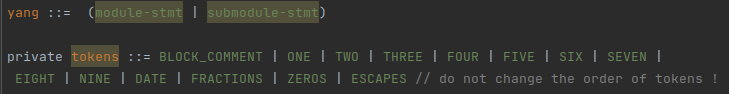

### Rewrite Fraction DigitsArg

  Rewrites fraction-digits-arg with proper tokens

  Before:

  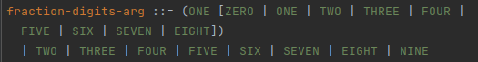

  After:

  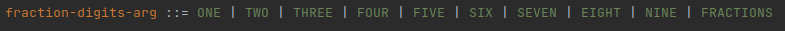

### Rewrite Yang Initialization

  Adds WSP | ZERO_LENGTH_STRING | LINEFEED | CARRIAGE_RETURN against empty yang error.

  Before:

  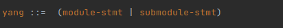

  After:

  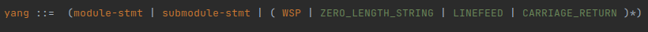

### Rewrite Positive Integer Value

  Rewrites positive-integer-value with proper tokens

  Before:

  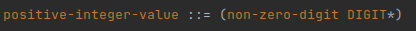

  After:

  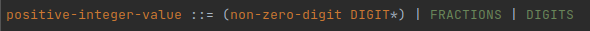

### Adjust Module And Submodule Stmt

  Making meta and linkage stmts optional in module and submodule stmts
  due to changes in their definitions to prevent grammar logic changes.

  Before:

  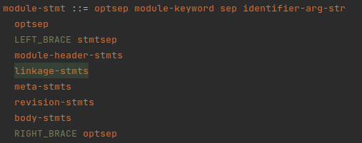

  After:

  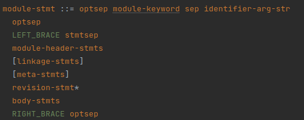

### Rewrite Module Header Stmts

  Adjust module-header-stmts for error recovery. Logic stays the same,
  statements can appear in any order and duplicities are checked in annotator.

  Before:

  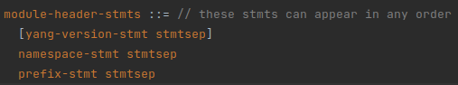

  After:

  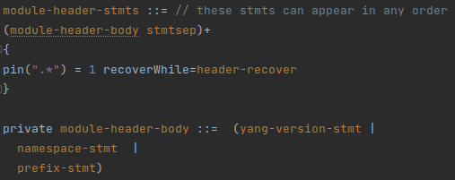

### Rewrite SubModule Header Stmts

  Adjust submodule-header-stmts for error recovery. Logic stays the same,
  statements can appear in any order and duplicities are checked in annotator.

  Before:

  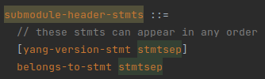

  After:

  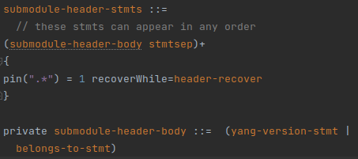

### Rewrite Data Def Stmt

  Switching positions of leaf-list-stmt and leaf-stmt due to error recovery always
  matching leaf-stmt if it was before leaf-list-stmt.

  Before:

  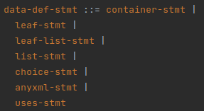

  After:

  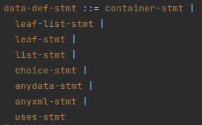

### Rewrite Body Stmts

  Decomposing body-stmts into sub statements due error recovery.
  Logic should remain the same only change against RFC 7950 is
  changing * (0 - infinity) to + (1 - infinity) not allowing empty body.

  Before:

  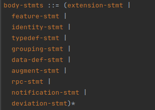

  After:

  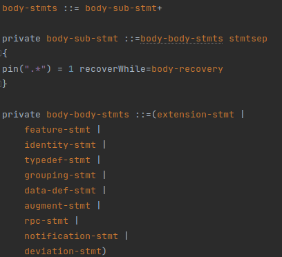

### Adjust Unknown Statement

  Allowing quoted-string in unknown statement.

  Before:

  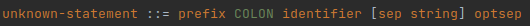

  After:

  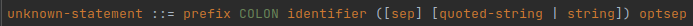

### Allow Version One

  Allowing version to be 1 or 1.1 instead of only 1.1

  Before:

  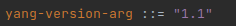

  After:

  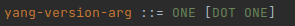

### Pattern Body Change

  Adding new pattern-body Statement to pattern-stmt expression in BNF file for separate
  Regex value expression

  Before:

  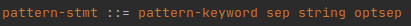

  After:

  

### Adjust Rel Path Keyexpr

  Adding token to the definition because it's prioritized to be matched in lexer
  as it's matching more characters at once.

  Before:

  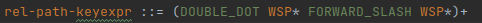

  After:

  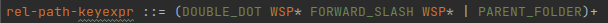

### Swap Decimal With Integer In Range Boundary Def

  When a decimal value was used, the integer-value statement was recognized first,
  and it resulted in an error. See [link](#swap-decimal-value-with-integer-value).

  By swapping these statements, the decimal-value statement will be recognized first resulting
  in correctly identifying both decimal-value and integer-value

  Before:

  

  After:

  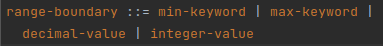

### Allow Comments

  Allowing single and multi-line comments in yang 1.1 according to validator.

  Before:

  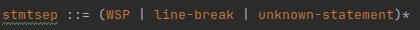

  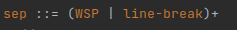

  After:

  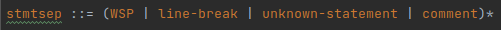

  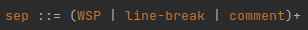

  Comment initialization:

  add extra keywords only for comment
  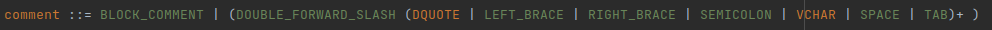

---

### Allows statements to be quoted

It's not explicitly defined in rfc but according to multiple validators it's allowed.

**Example**

Before

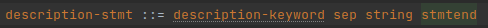

After

### Split deviation statement

Part of the definition is extracted to the separate statement to allow annotator to check for duplicities.
Doesn't change the logic of the grammar.

**Example**

Before

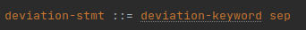

After

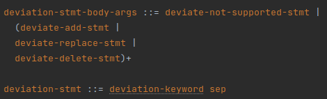

### Removing optional

Allowing parser to move on the next statement instead of matching 1st statement as empty in type-body-stmts.
Logic was intended this way.

**Example**

Before

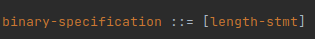

After

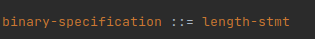

### Sub delims adjustment

Removes semicolon from sub-delims allowing parser to match it as stmtend
after URI

**Example**

Before

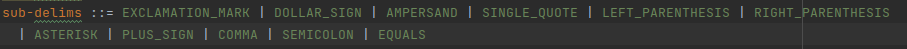

After

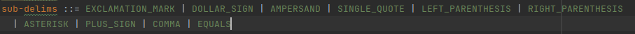

### Additional rules

Method adds additional rules to the grammar.
string-splitter allows that some stmts can be in multiple strings joined with +
quoted-path-arg allows quoted path
vchar and quoted-vchar are replacement for yang-char until external rule checkString will work properly
Everything except chars is valid in yang 1.1 according to validators.
These rules have been changed during development.

**Added rules**

new:

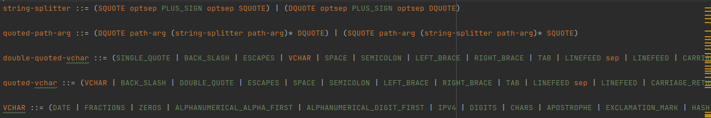

changed: 

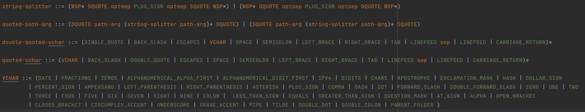

### Quoted augment arg

Augment-arg can be quoted according to validators.

**Example**

Before

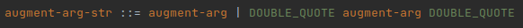

After

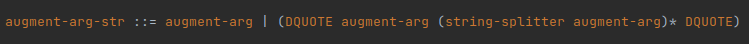

### Quoted path

Path can be quoted according to validators.

**Example**

Before

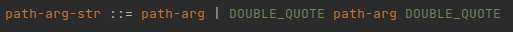

After

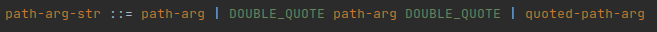

### Quoted string splitter

String-splitter can be quoted according to validators.

**Example**

Before

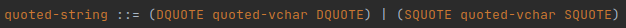

After

### Changing linkage body

Changing linkage body statement in BNF file to define that linkage must contain
at least one statement to Format correctly in Yang 1.1

**Example**

Before

After

### Changing meta statement body

Changing meta statement body in BNF file to define that meta must contain
at least one statement to Format correctly and error recovery to be functional.
Logic stays the same, statements can appear in any order and duplicities are
checked in annotator.

**Example**

Before

After

### Rewrite scheme

New tokens added due to double-click word selection.

**Example**

Before

After

### Rewrite port

New tokens added due to double-click word selection.

**Example**

Before

After

### Improved date validation

Improved check for valid year/month/day. Double-click word selection.

**Example**

Before

After

### Rewrite identifier

New tokens added due to double-click word selection and multi-line capability.

**Example**

Before

After

### Rewrite unreserved

New tokens added due to double-click word selection.

**Example**

Before

After

### Swap decimal value With integer value

### Allow stmts to be Quoted

quoteStmts(lines)

### Swap decimal with integer in range boundary def

Decimal values, e.g. 7.58, were incorrectly identified as integers which caused the dot "." (decimal point),
that separates the decimal place from the whole, to trigger an error. The reason for the integer
preference over the decimal is that the integer-value was defined before the decimal-value
in the grammar(according to [rfc 6020](https://www.rfc-editor.org/rfc/rfc6020.html)).

**Decimal number highlighted as error**
  
**BNF transformed from the original ABNF (RFC 6020)**  

After swapping the two statements, integer-value and decimal-value, the error highlighting disappeared.  
**Modification to the BNF to support decimal values**  
  
**No error highlighting after the integer/decimal value swap**  
  
From this behavior we can assume that when the first digit of a decimal number was inserted, it was
identified as an integer-value. The decimal point (i.e. the dot: ".") then caused an error. This is

no longer an issue after the swap in the grammar rule.

no longer an issue after the swap in the grammar rule.

### Make separator rules private

The method [allowComments()](#allow-comments) adds support for comments into the definitions of
separators (sep, optsep, stmtsep). These separators contain white space characters and should be also
treated as white spaces, but they can't be treated this way because they might contain comments.
This created problems in formatting, which is the reason why they needed to be flagged as private.  
This ensures, that PsiElement is not created for these in the PsiTree, which results in comments
not being a child of a node (as can be seen in the next figure), that should be treated as a white space.

After this change, no separator (i.e. sep, optsep, stmtsep) psi node is created. This results in
comments having non-whitespace parents (shown in next figure). Finally, no problems with formatting.

This change solves problem with formatting. The problem was, that comments were not being covered by block
(whitespaces are skipped during block creation). This resulted in an exception being thrown when
manipulating with comments.

### String separation possibility for paths

The method addStringSplitterForPaths() adds support for string separators into the path definition.
String separation in paths was not possible for not completed definitions of path based on RFC.
This threw an error that did not allow next elements to be parsed correctly. The solution is to insert 
split-strings (plus sign surrounded with quotes) inside the definitions of paths.

**Augment arg str**  

before:  

after:  

  

**Absolute schema nodeid**  

before:  

  

after:  

  

### Path definitions

before:  

  

after:  

  

#### Path predicate

before:

after:

#### Relative Path expressions

before:

after:

#### Segments
before:

after:

### Allow indents for certain strings

The method allowIndentString() adds support for keyword strings to have proper indent. 

Before:  

After:  

### Resolved inconsistent quantifiers

Changed quantifiers for **linkage-stmts** and **body-stmts** according to RFC6020  
Before:  
  
After:  

### Rewrite Uses Augment Stmt

Overwrite UsesAugmentStmt according to rfc.

                 +--------------+---------+-------------+
                 | substatement | section | cardinality |
                 +--------------+---------+-------------+
                 | augment      | 7.15    | 0..1        |
                 | description  | 7.19.3  | 0..1        |
                 | if-feature   | 7.18.2  | 0..n        |
                 | refine       | 7.12.2  | 0..1        |
                 | reference    | 7.19.4  | 0..1        |
                 | status       | 7.19.2  | 0..1        |
                 | when         | 7.19.5  | 0..1        |
                 +--------------+---------+-------------+

Before:

After:

### Add splitters for if-features

Changed if-feature expressions, so that splitting the string is possible.

before:

after:

### Make linkages referencable

Changed import and linkage statements string arguments so hey can be referenced. 
Grammar is the same, only these elements implement referencing

before:

after:

### Added single quote possibility 
Added single quote possibility for **identifier-ref-arg** and **identifier-ref-arg-str** statements

Before:  

After:  

### Rewrite Augment Stmt  

Changed Augment-Stmt according to rfc6020.

                 +--------------+---------+-------------+
                 | substatement | section | cardinality |
                 +--------------+---------+-------------+
                 | anyxml       | 7.10    | 0..n        |
                 | case         | 7.9.2   | 0..n        |
                 | choice       | 7.9     | 0..n        |
                 | container    | 7.5     | 0..n        |
                 | description  | 7.19.3  | 0..1        |
                 | if-feature   | 7.18.2  | 0..n        |
                 | leaf         | 7.6     | 0..n        |
                 | leaf-list    | 7.7     | 0..n        |
                 | list         | 7.8     | 0..n        |
                 | reference    | 7.19.4  | 0..1        |
                 | status       | 7.19.2  | 0..1        |
                 | uses         | 7.12    | 0..n        |
                 | when         | 7.19.5  | 0..1        |
                 +--------------+---------+-------------+

Before:  

After:  

### Change input and output data def stmt cardinality
Changed input-stmt and output-stmt data-def-stmt cardinality to 0..n 

Input-stmt

            7.14.2.1.  The input's Substatements (RFC7950)

                +--------------+---------+-------------+
                | substatement | section | cardinality |
                +--------------+---------+-------------+
                | anydata      | 7.10    | 0..n        |
                | anyxml       | 7.11    | 0..n        |
                | choice       | 7.9     | 0..n        |
                | container    | 7.5     | 0..n        |
                | grouping     | 7.12    | 0..n        |
                | leaf         | 7.6     | 0..n        |
                | leaf-list    | 7.7     | 0..n        |
                | list         | 7.8     | 0..n        |
                | must         | 7.5.3   | 0..n        |
                | typedef      | 7.3     | 0..n        |
                | uses         | 7.13    | 0..n        |
                +--------------+---------+-------------+

Before:

After:

Output-stmt

            7.14.3.1.  The output's Substatements (RFC7950)

                +--------------+---------+-------------+
                | substatement | section | cardinality |
                +--------------+---------+-------------+
                | anydata      | 7.10    | 0..n        |
                | anyxml       | 7.11    | 0..n        |
                | choice       | 7.9     | 0..n        |
                | container    | 7.5     | 0..n        |
                | grouping     | 7.12    | 0..n        |
                | leaf         | 7.6     | 0..n        |
                | leaf-list    | 7.7     | 0..n        |
                | list         | 7.8     | 0..n        |
                | must         | 7.5.3   | 0..n        |
                | typedef      | 7.3     | 0..n        |
                | uses         | 7.13    | 0..n        |
                +--------------+---------+-------------+

Before:

After:

### Edited identifier for support string splitter in if-feature
### Edited identifier to support string splitter in if-feature
Added "**or**","**and**" and "**not**" keywords as possible to **identifier** to support 
string-splitter in **if-feature** stmt after these keywords

Before:  

After:  

---

## ***More methods are used that are not yet documented***
