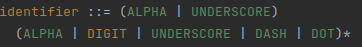

# Generating BNF grammar with some deviations
path = intelij-plugin/src/main/gen/tech/pantheon/yanginator/plugin

## Deviations from the original grammar

Following methods are used to modify the transformed BNF grammar for the plugin to function
correctly.

* `quoteStmts(lines)` [link](#Allows-statements-to-be-quoted)

* `splitDeviationStmt(result);` [link](#Split-deviation-statement)

* `removeOptional(result);` [link](#Removing-optional)

* `subDelimsAdjustment(result);` [link](#Sub-delims-adjustment)

* `additionalRules(result);` [link](#Additional-rules)

* `quotedAugmentArg(result);` [link](#Quoted-augment-arg)

* `quotedPath(result);` [link](#Quoted-path)

* `quotedStringSplitter(result);` [link](#Quoted-string-splitter)

* `revisionComment(result);` [link](#Comment-revision)

* `revisionReplace(result);` [link](#Changing-revision-statement)

* `linkageBodyReplace(result);` [link](#Changing-linkage-body)

* `metaBodyReplace(result);` [link](#Changing-meta-statement-body)

* `rewriteScheme(result);` [link](#Rewrite-scheme)

* `rewritePort(result);` [link](#Rewrite-port)

* `rewriteDateArg(result);` [link](#Improved-date-validation)

* `rewriteIdentifier(result);` [link](#Rewrite-identifier)

* `rewriteUnreserved(result);` [link](#Rewrite-unreserved)

* `rewriteZeroIntegerValue(result);`

* `rewriteIPV4Address(result);`

* `orderTokensForLexer(result);`

* `rewriteFractionDigitsArg(result);`

* `rewritePositiveIntegerValue(result);`

* `adjustModuleAndSubmoduleStmt(result);`

* `rewriteModuleHeaderStmts(result);`

* `rewriteSubModuleHeaderStmts(result);`

* `rewriteDataDefStmt(result);`

* `rewriteBodyStmts(result);`

* `adjustUnknownStatement(result);`

* `allowVersionOne(result);`

* `patternBodyChange(result);`

* `adjustRelPathKeyexpr(result);`

* `swapDecimalWithIntegerInRangeBoundaryDef(result);` [link](#swap-decimal-with-integer-in-range-boundary-def)

* `allowComments(result);`

* `makeSeparatorRulesPrivate(result);` [link](#make-separator-rules-private)

---

### Allows statements to be quoted
It's not explicitly defined in rfc but according to multiple validators it's allowed.

**Example**

Before

After

### Split deviation statement
Part of the definition is extracted to the separate statement to allow annotator to check for duplicities.
Doesn't change the logic of the grammar.

**Example**

Before

After

### Removing optional
Allowing parser to move on the next statement instead of matching 1st statement as empty in type-body-stmts.
Logic was intended this way.

**Example**

Before

After

### Sub delims adjustment
Removes semicolon from sub-delims allowing parser to match it as stmtend
after URI

**Example**

Before

After

### Additional rules
Method adds additional rules to the grammar.
string-splitter allows that some stmts can be in multiple strings joined with +
quoted-path-arg allows quoted path
vchar and quoted-vchar are replacement for yang-char until external rule checkString will work properly
Everything except chars is valid in yang 1.1 according to validators.

**Added rules**

### Quoted augment arg
Augment-arg can be quoted according to validators.

**Example**

Before

After

### Quoted path
Path can be quoted according to validators.

**Example**

Before

After

### Quoted string splitter
String-splitter can be quoted according to validators.

**Example**

Before

After

### Comment revision
Comment revision statement to make revision optional.

**Example**

Before

After

### Changing revision statement
Changing revision statement in module and submodule to make revision optional
and Format correctly in Yang 1.1

**Example**

Before

After

### Changing linkage body
Changing linkage body statement in BNF file to define that linkage must contain
at least one statement to Format correctly in Yang 1.1

**Example**

Before

After

### Changing meta statement body
Changing meta statement body in BNF file to define that meta must contain
at least one statement to Format correctly and error recovery to be functional.
Logic stays the same, statements can appear in any order and duplicities are
checked in annotator.

**Example**

Before

After

### Rewrite scheme
New tokens added due to double-click word selection.

**Example**

Before

After

### Rewrite port
New tokens added due to double-click word selection.

**Example**

Before

After

### Improved date validation
Improved check for valid year/month/day. Double-click word selection.

**Example**

Before

After

### Rewrite identifier
New tokens added due to double-click word selection.

**Example**

Before

After

### Rewrite unreserved
New tokens added due to double-click word selection.

**Example**

Before

After

### Swap decimal value With integer value

### Allow stmts to be Quoted
quoteStmts(lines)
### Swap decimal with integer in range boundary def

Decimal values, e.g. 7.58, were incorrectly identified as integers which caused the dot "." (decimal point),
that separates the decimal place from the whole, to trigger an error. The reason for the integer
preference over the decimal is that the integer-value was defined before the decimal-value
in the grammar(according to [rfc 6020](https://www.rfc-editor.org/rfc/rfc6020.html)).

**Decimal number highlighted as error**
  
**BNF transformed from the original ABNF (RFC 6020)**  

After swapping the two statements, integer-value and decimal-value, the error highlighting disappeared.  
**Modification to the BNF to support decimal values**  
  
**No error highlighting after the integer/decimal value swap**  
  
From this behavior we can assume that when the first digit of a decimal number was inserted, it was
identified as an integer-value. The decimal point (i.e. the dot: ".") then caused an error. This is

no longer an issue after the swap in the grammar rule.

no longer an issue after the swap in the grammar rule.  
### Make separator rules private
The method [allowComments()](#allow-comments) adds support for comments into the definitions of 
separators (sep, optsep, stmtsep). These separators contain white space characters and should be also
treated as white spaces, but they can't be treated this way because they might contain comments. 
This created problems in formatting, which is the reason why they needed to be flagged as private.  
This ensures, that PsiElement is not created for these in the PsiTree, which results in comments 
not being a child of a node (as can be seen in the next figure), that should be treated as a white space.

  
After this change, no separator (i.e. sep, optsep, stmtsep) psi node is created. This results in 
comments having non-whitespace parents (shown in next figure). Finally, no problems with formatting.

  
This change solves problem with formatting. The problem was, that comments were not being covered by block
(whitespaces are skipped during block creation). This resulted in an exception being thrown when
manipulating with comments.

---
## ***More methods are used that are not yet documented***
