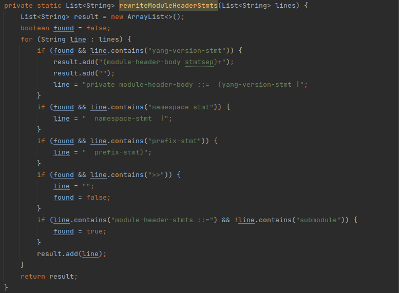

# Generating BNF grammar with some deviations
path = intelij-plugin/src/main/gen/tech/pantheon/yanginator/plugin

## Deviations from the original grammar

Following methods are used to modify the transformed BNF grammar for the plugin to function
correctly.

* `quoteStmts(lines)`

* `splitDeviationStmt(result);`

* `removeOptional(result);`

* `subDelimsAdjustment(result);`

* `additionalRules(result);`

* `quotedAugmentArg(result);`

* `quotedPath(result);`

* `quotedStringSplitter(result);`

* `revisionComment(result);`

* `revisionReplace(result);`

* `linkageBodyReplace(result);`

* `metaBodyReplace(result);`

* `rewriteScheme(result);`

* `rewritePort(result);`

* `rewriteDateArg(result);`

* `rewriteIdentifier(result);`

* `rewriteUnreserved(result);`

* `rewriteZeroIntegerValue(result);`

  Rewrites zero-integer-value with proper tokens
  

* `rewriteIPV4Address(result);`

  Rewrites IPv4address with proper token
  

* `orderTokensForLexer(result);`

  Order of tokens sets the priority for lexer when it needs to pick one of the multiple matches.
  The sooner it occurs in bnf the higher the priority to be matched if multiple tokens can match multiple
  different characters or strings
  

* `rewriteFractionDigitsArg(result);`

  Rewrites fraction-digits-arg with proper tokens
  

* `rewritePositiveIntegerValue(result);`

  Rewrites positive-integer-value with proper tokens
  

* `adjustModuleAndSubmoduleStmt(result);`

  Making meta and linkage stmts optional in module and submodule stmts
  due to changes in their definitions to prevent grammar logic changes.
  

* `rewriteModuleHeaderStmts(result);`

  Adjust module-header-stmts for error recovery. Logic stays the same,
  statements can appear in any order and duplicities are checked in annotator.
  

* `rewriteSubModuleHeaderStmts(result);`

  Adjust submodule-header-stmts for error recovery. Logic stays the same,
  statements can appear in any order and duplicities are checked in annotator.
  

* `rewriteDataDefStmt(result);`

  Switching positions of leaf-list-stmt and leaf-stmt due to error recovery always
  matching leaf-stmt if it was before leaf-list-stmt.
  

* `rewriteBodyStmts(result);`

  Decomposing body-stmts into sub statements due error recovery.
  Logic should remain the same only change against RFC 7950 is
  changing * (0 - infinity) to + (1 - infinity) not allowing empty body.
  

* `adjustUnknownStatement(result);`

  Allowing quoted-string in unknown statement.
  

* `allowVersionOne(result);`

  Allowing version to be 1 or 1.1 instead of only 1.1
  

* `patternBodyChange(result);`

  Adding new pattern-body Statement to pattern-stmt expression in BNF file for separate
  Regex value expression
  

* `adjustRelPathKeyexpr(result);`

  Adding token to the definition because it's prioritized to be matched in lexer
  as it's matching more characters at once.
  

* `swapDecimalWithIntegerInRangeBoundaryDef(result);`

  When a decimal value was used, the integer-value statement was recognized first,
  and it resulted in an error. See [link](#swap-decimal-value-with-integer-value).
  
  By swapping these statements, the decimal-value statement will be recognized first resulting
  in correctly identifying both decimal-value and integer-value
  

* `allowComments(result);`

  Allowing single and multi-line comments in yang 1.1 according to validator.
  
  

---

### Allow stmts to be Quoted
quoteStmts(lines)
### Swap decimal value With integer value

Decimal values, e.g. 7.58, were incorrectly identified as integers which caused the dot "." (decimal point),
that separates the decimal place from the whole, to trigger an error. The reason for the integer
preference over the decimal is that the integer-value was defined before the decimal-value 
in the grammar(according to [rfc 6020](https://www.rfc-editor.org/rfc/rfc6020.html)).

**Decimal number highlighted as error**
  
**BNF transformed from the original ABNF (RFC 6020)**  
  

After swapping the two statements, integer-value and decimal-value, the error highlighting disappeared.  
**Modification to the BNF to support decimal values**  
  
**No error highlighting after the integer/decimal value swap**  
  
From this behavior we can assume that when the first digit of a decimal number was inserted, it was
identified as an integer-value. The decimal point (i.e. the dot: ".") then caused an error. This is
no longer an issue after the swap in the grammar rule.  
---
## ***More methods are used that are not yet documented***
