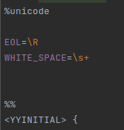
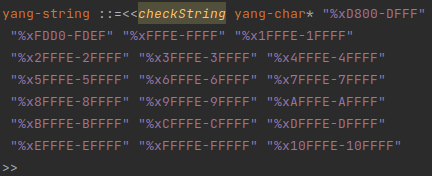

# Generating BNF grammar with Lexer and Parser
path = intelij-plugin/src/main/gen/tech/pantheon/yanginator/plugin

**In order to generate fully functional grammar with lexer and parser follow these steps :**

* Run RFCParser.main() with correct paths to your ABNF files
* Right-click on your generated BNF (path/YangGrammar.bnf) and select "Generate Parser Code"
* Right-click your BNF file again and select "Generate JFlex Lexer", select your path into lexer directory(path/lexer) with name _YangLexer.flex
* Run RFCParser.main() again
* Right-click on _YangLexer.flex and select "Run JFlex Generator"
* Open YangParser.java that is located in path/parser and add these imports :
* import static tech.pantheon.yanginator.plugin.external.ExternalRules.anyOrder;
* import static tech.pantheon.yanginator.plugin.external.ExternalRules.checkString;
  
## Transformation of ABNF to BNF

Following methods are used for transformation of Augmented Backus–Naur form (.abnf) grammar into Backus–Naur form (.bnf)
.

**For your own safety and mental well-being, do not change the order in which the methods are called.**

* `replaceAllAbnfTokens(oldGrammar)`
* `deleteWhitespaces(result)`
* `rewriteNtoMMultiplier(result);`
* `rewriteDigitMultiplier(result, GrammarKitRFCUtils.MULTIPLIER_ZERO_TO_N_TIMES);`
* `rewriteDigitMultiplier(result, GrammarKitRFCUtils.MULTIPLIER_DIGIT_TIMES);`
* `rewriteDigitMultiplier(result, GrammarKitRFCUtils.MULTIPLIER_N_TIMES);`
* `trimAndAppendOperator(result, "1*", "+")`
* `trimAndAppendOperator(result, "*", "*")`
* `replaceAsterWord(result, "1*")`
* `replaceAsterWord(result, "*")`
* `replaceHexadecimalRange(result)`
* `replaceHexadecimal(result)`
* `rewriteStringRules(result)`

## YANG versions

Abnf specification for different YANG versions can be found in RFCs:

* YANG 1.0 - defined in RFC 6020
* YANG 1.1 - defined in RFC 7950

### 1. Replace tokens

Method  `replaceAllAbnfTokens(List<String> oldGrammar)` takes original .abnf grammar as a parameter. 
Except tokens enclosed inside double quotes.

* The method transforms:
    * Equal sign: `=` changed to `::=` 
    * Or: `/` changed to `|`
    * Comment: `;;` changed to `//` 
    * Comment: `;` changed to `//` 

Example of original .abnf grammar:

After transformation of equal sign, or and comment:

### 2. Delete whitespaces

Method `deleteWhitespaces(result)` removes redundant spaces:

### 3. Rewrite multiplier M-to-N

Method `rewriteNtoMMultiplier(result)` overrides **M-to-N** multiplier which specifies the minimum and maximum number
of repetition of adjacent part of the rule.

Example of M-to-N multiplier:

[//]: # (![M to N multiplier]&#40;doc-images/04_multiplier_m_n_before.png&#41;)

 

After rewriting the multiplier:

[//]: # (![Rewritten M to N multiplier]&#40;doc-images/05_multiplier_m_n_after.png&#41;)

 

### 4. Rewrite digit multiplier

Method `rewriteDigitMultiplier(final List<String> lines, Pattern typeOfToken)` is used 3 times,
always with a different `Pattern typeOfToken` argument.

#### 4.1 Rewrite digit multiplier (zero-to-N)

Multiplier **zero-to-N times** is overridden using Pattern  `MULTIPLIER_ZERO_TO_N_TIMES)`

Example of 0-to-N multiplier:

[//]: # (![M to N multiplier]&#40;doc-images/06_multiplier_zero_n_before.png&#41;)

 

After rewriting the multiplier:

[//]: # (![Rewritten M to N multiplier]&#40;doc-images/07_multiplier_zero_n_after.png&#41;)

 

#### 4.2 Rewrite digit multiplier (N times String)

Multiplier **N times** is overridden using Pattern `MULTIPLIER_N_TIMES_WORD)`

Example of multiplier:

[//]: # (![M to N multiplier]&#40;doc-images/08_multiplier_DIGIT_before.png&#41;)

 

After rewriting the multiplier:

[//]: # (![Rewritten M to N multiplier]&#40;doc-images/09_multiplier_DIGIT_after.png&#41;)

 

#### 4.3 Rewrite digit multiplier (N times Parentheses)

Multiplier **N times** is overridden using Pattern `MULTIPLIER_N_TIMES_PARENTHESES`

Example of multiplier:

[//]: # (![M to N multiplier]&#40;doc-images/10_multiplier_parentheses_before.png&#41;)

After rewriting the multiplier:

[//]: # (![Rewritten M to N multiplier]&#40;doc-images/11_multiplier_parentheses_after.png&#41;)

### 5. Replace "1*" multiplication operator

Method `trimAndAppendOperator(result,"1*","+")` removes .abnf operator `1*`
placed in front of parentheses and adds its .bnf equivalent `+` to correct position.

* Operator `1*<element>` requires at least one repetition of `<element>`.

### OLD 6. Replace "*" multiplication operator

Method `trimAndAppendOperator(result,"*","*")` removes .abnf operator `*`
placed in front of parentheses and adds its .bnf equivalent `*` to correct position.

* Operator `*<element>` allows 0 or any number of repetitions of `<element>`.

Example of original .abnf grammar:

After transformation of `*` multiplication operator:

### 7. Replace "1*" multiplication operator

Method `replaceAsterWord(result, "1*")` removes .abnf operator `1*`
placed in front of string and adds its .bnf equivalent `+` to correct position.

* Operator `1*string` requires at least one repetition of `string`.

Example of original .abnf grammar:

After transformation of `1*` multiplication operator:

### 8. Replace "*" multiplication operator

Method `replaceAsterWord(result, "*")` removes .abnf operator `*`
placed in front of a string and adds its .bnf equivalent `*` to correct position.

* Operator `*string` allows 0 or any number of repetitions of `string`.

Example of original .abnf grammar:

After transformation of `*` multiplication operator:

### 9. Replace range of hexadecimal values

Method `replaceHexadecimalRange(result)` replaces range of hexadecimal values with corresponding
string values.

Example of original .abnf grammar with range hexadecimal values:

After transformation of hexadecimal range to corresponding strings:

### 10. Replace single hexadecimal value

Method `replaceHexadecimal(result)` replaces single hexadecimal value with corresponding string value.

Example of original .abnf grammar with hexadecimal value:

After transformation of hexadecimal value to corresponding string:

### 11. Replace string rules

Method `rewriteStringRules(List<String>)` replaces commentaries enclosed in angle brackets

Example of original .abnf -str rule:

After transformation of rule:

### 12. ReplaceTokens
Method `replaceTokens(List<String> lines, List<FlexerToken> tokens)` replaces all the values in double quotes
that were added into tokens.xml

Example before replacing :

After token replacement: 

### 13. CommentDeprecatedDefinition

Method `commentDeprecatedDefinition(List<String> lines, String deprecatedDefinition)` puts two forward slashes before
definition int the parameter

Example before : 

After method finishes : 

### 14. Replace Words

Method `replaceWords(List<String> lines, String wordToBeReplaced, String excludedCombination, String replacement)`
will look for wordToBeReplaced in the list and replace it with replacement. Additionally, method removes all necessary
duplicates without changing the logic of expression. Additional information can be given via excludedCombination if necessary,
otherwise should be null.

Example before : 

After method finishes : 

### 15. Comment Rules

Method `commentRules(List<String> lines, String comment, String delimiter)` will extract definition from 
comment after delimiter and puts it in the expression. Comment can specify in the definition should be quoted or unquoted

Example before:

  

Example after quoted : 

Example after unquoted :

### 16. Add Tokens Into Lexer

Method `addTokensIntoLexer(List<String> lines, List<FlexerToken> tokens)` adds tokens used in replacing into lexer file

Example before : 

Example after :

### 17. XML start for 6020

Method `xmlStartFor6020(List<String> lines, String comment)` extract special comment definition in rfc6020 and applies it

Example before :

Example after :

### 18. Add anyOrder

Method `addAnyOrder(List<String> lines)` adds anyOrder external rule at correct places according to comments.
End of rule can be specified by start of another expression or RIGHT_BRACE token.

Example before :

Example after without RIGHT_BRACE :

Example after with RIGHT_BRACE :

### 19. Add checkString

Method `addCheckString(List<String> lines, List<String> ranges)` adds external rule checkString to yang-string expression.
Parameter ranges is obtained from `extractRangesfromABNF(List<String> abnf)` method.

Example before :

Example after : 

### 20. Extract ranges from ABNF

Method `extractRangesfromABNF(List<String> abnf)` extracts ranges from ABNF file containing yang-string and yang-char definitions.

Example of yang-char definition in ABNF file : 

