# Transformation of ABNF to BNF

Following methods are used for transformation of Augmented Backus–Naur form (.abnf) grammar into Backus–Naur form (.bnf)
.

<b>For your own safety and mental well-being, do not change the order in which the methods are called.</b>

<ul>
  <li>replaceAllAbnfTokens(oldGrammar)</li>
  <li>deleteWhitespaces(result)</li>
  <li>trimAndAppendOperator(result, "1*", "+")</li>
  <li>trimAndAppendOperator(result, "*", "*")</li>
  <li>replaceAsterWord(result, "1*")</li>
  <li>replaceAsterWord(result, "*")</li>
  <li>replaceHexadecimalRange(result)</li>
  <li>replaceHexadecimal(result)</li>
  <li>rewriteStringRules(result)</li>
</ul>

## YANG versions

Abnf specification for different YANG versions can be found in RFCs:

* YANG 1.0 - defined in RFC 6020
* YANG 1.1 - defined in RFC 7950

### 1. Replace tokens

Method  <code><b>replaceAllAbnfTokens(List<String> oldGrammar)</b></code> takes original .abnf grammar as a parameter. 
Except tokens enclosed inside double quotes.

* The method transforms:
    * Equal sign: = changed to ::= 
    * Or: / changed to | 
    * Comment: ;; changed to // 
    * Comment: ; changed to // 

Example of original .abnf grammar:

After transformation of equal sign, or and comment:

### 2. Delete whitespaces

Method <code><b>deleteWhitespaces(result)</b></code> removes redundant spaces:

### 3. Replace "1*" multiplication operator

Method <code><b>trimAndAppendOperator(result,"1*","+")</b></code> removes .abnf operator "1*"
placed in front of parentheses and adds its .bnf equivalent "+" to correct position.

* Operator "1*\<element\>" requires at least one repetition of \<element\>.

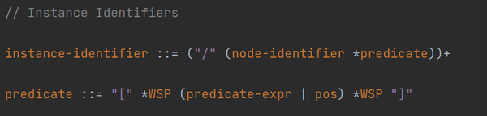

### 4. Replace "*" multiplication operator

Method <code><b>trimAndAppendOperator(result,"*","*")</b></code> removes .abnf operator "\*"
placed in front of parentheses and adds its .bnf equivalent "\*" to correct position.

* Operator "*\<element\>" allows 0 or any number of repetitions of \<element\>.

Example of original .abnf grammar:

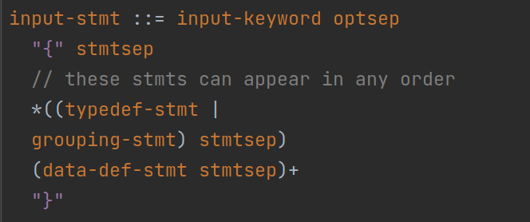

After transformation of "*" multiplication operator:

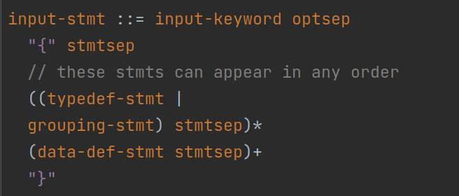

### 5. Replace "1*" multiplication operator

Method <code><b>replaceAsterWord(result, "1*")</b></code> removes .abnf operator "1*"
placed in front of string and adds its .bnf equivalent "+" to correct position.

* Operator "1*string" requires at least one repetition of "string".

Example of original .abnf grammar:

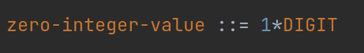

After transformation of "1*" multiplication operator:

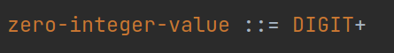

### 6. Replace "*" multiplication operator

Method <code><b>replaceAsterWord(result, "*")</b></code> removes .abnf operator "\*"
placed in front of a string and adds its .bnf equivalent "\*" to correct position.

* Operator "*string" allows 0 or any number of repetitions of "string".

Example of original .abnf grammar:

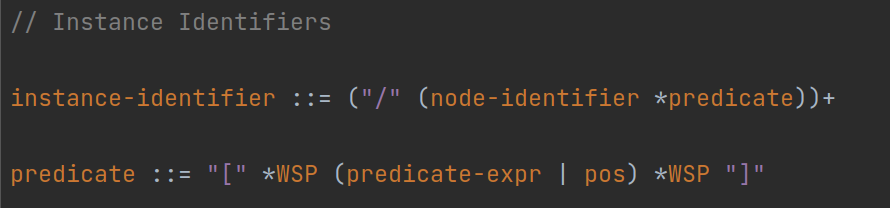

After transformation of "1*" multiplication operator:

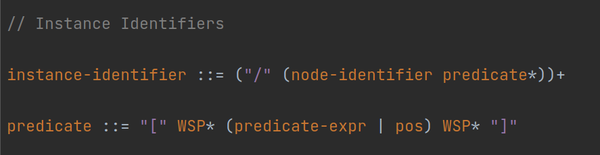

### 7. Replace range of hexadecimal values

Method <code><b>replaceHexadecimalRange(result)</b></code> replaces range of hexadecimal values with corresponding
string values.

Example of original .abnf grammar with range hexadecimal values:

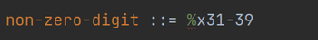

After transformation of hexadecimal range to corresponding strings:

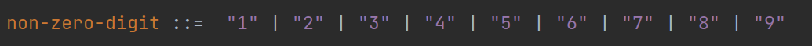

### 8. Replace single hexadecimal value

Method <code><b>replaceHexadecimal(result)</b></code> replaces single hexadecimal value with corresponding string value.

Example of original .abnf grammar with hexadecimal value:

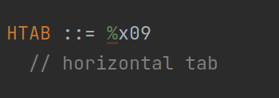

After transformation of hexadecimal value to corresponding string:

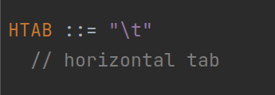

### 9. Replace string rules

Method <code><b>rewriteStringRules(List<String>)</b></code> replaces commentaries enclosed in angle brackets

Example of original .abnf -str rule:

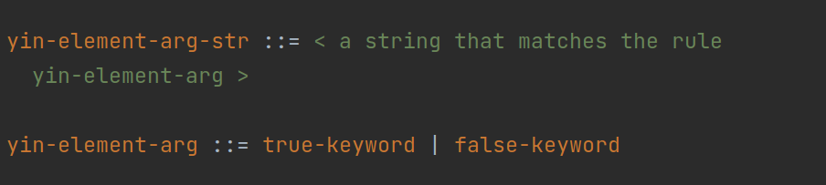

After transformation of rule:

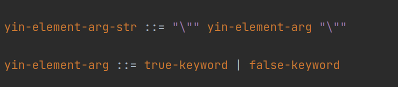
